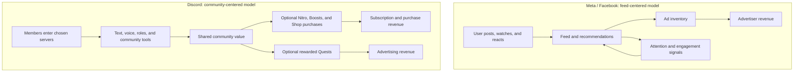

## A platform can make money without making users feel monetized.

We all know Facebook is free.

But it is not really free. We pay for it with attention. We scroll, stop, react, watch, and leave behind enough signals for ads to become more relevant next time.

That model is not automatically bad. It is the reason billions of people can use Facebook, Instagram, and Messenger without a subscription. It helps small businesses reach customers, helps families stay connected, and makes a huge digital network accessible to people who may never pay for an app.

_But it creates a particular kind of relationship._

The platform needs more attention to create more opportunities for advertising. So the feed needs to keep moving. More recommendations. More notifications. More reasons to come back.

Discord feels different.

People do not usually open Discord to see what the algorithm decided was important today. They open it because their friends are in a server, their class has an announcement, their guild is about to play, or their community is already having a conversation.

And that is where the monetization paradox begins.

> **The Reality Check:** The question is not whether a platform has ads or subscriptions. The question is whether paying feels like supporting _your space_ or simply paying the platform to leave you alone.

## First, Discord is not ad-free anymore.

It is easy to describe Discord as the anti-ad social network. That was closer to true before, but it is no longer completely accurate.

Discord now runs Quests: optional, rewarded promotions where users can watch, play, or stream something to earn a reward. Discord also allows users to control whether its activity and third-party data are used to personalize sponsored content.

So this is not a simple story of **Discord has no ads, Meta has ads.**

The better distinction is in the format.

Meta's business is built primarily around a feed: advertisers pay for reach, and the platform earns when it can place useful ads in front of a very large audience. Discord is building advertising too, particularly around games, but its original experience is still centered on rooms people choose to join. Its paid features are also tied more directly to the experience inside those rooms.

That difference changes how monetization feels.

## Discord sells upgrades, not basic belonging.

Discord's free tier is useful enough that a group can actually live there. You can create servers, set up channels, talk through text and voice, share a few files, and invite people without immediately reaching for a credit card.

Then Discord sells the things that make the experience better:

- Nitro for higher upload limits, better streaming, and profile customization.
- Server Boosts that unlock perks for a whole community.
- Profile decorations, effects, and other digital cosmetics through the Shop.

Notice what is not being sold: the ability to participate in the conversation at all.

That matters. A student does not need Nitro to join their study group. A new guild member does not need a Boost to hear their teammates. The basic social value is already there.

So when someone pays, it can feel less like a toll and more like an upgrade. They are buying a better stream for friends, a larger upload limit for their work, or an avatar that feels more like them.

It is the same reason people buy a skin in a game even when the game itself still works perfectly. The purchase is not always about utility. Sometimes, it is about identity.

## Server Boosts make monetization feel shared.

This is probably Discord's cleverest move.

Most online communities are used to one person paying the bill. The server owner pays for hosting. The creator pays for tools. The group benefits, but one person carries the cost.

Server Boosts spread that idea across the community. A few members can contribute to unlock better audio quality, more emoji slots, a banner, and other shared perks. The feature is not essential, but it gives people a small and visible way to support a place they enjoy.

In other words, Discord does not only monetize individuals. It monetizes the feeling of **we built this together.**

That is a very different emotional transaction from seeing a sponsored post between updates from friends.

## The product is a clubhouse, not a stage.

Facebook and Instagram are built around publishing. You post something, people react, and the platform distributes it further. Even in private groups, there is still a strong sense that you are putting something out into a larger social world.

Discord is more like infrastructure. It gives people rooms, roles, permissions, voice channels, bots, and a long-running place to gather. A good server can feel like a digital clubhouse: messy, specific, and shaped by the people inside it.

That creates something product teams often underestimate: psychological ownership.

When people feel that a place is theirs, they tolerate its rough edges. They contribute emojis, set up bots, welcome new members, and sometimes pay for upgrades. They are not only consuming a product. They are helping maintain a small world inside it.

Of course, Discord still owns the building. It can change the rules, pricing, and product direction at any time. But the community work feels personal enough that users behave differently from passive feed consumers.

Here is the simplified product picture. It is not a literal map of either company's internal systems; it shows where the user experience and the money flow meet.

## Why younger users often prefer the smaller room.

For many younger users, traditional social networks can feel crowded.

Your relatives are there. Old classmates are there. Employers, teachers, and random acquaintances may be there too. Posting can start to feel like a performance because the audience is undefined and permanent.

Discord solves a different problem. It is often invite-based, interest-based, and more conversational. You do not need to broadcast a polished version of your life. You can just join a call, share a meme, ask a question, or sit quietly while friends play.

That does not mean Discord is automatically healthier, safer, or less addictive. Any online space can become noisy or demanding. But it explains the pull: smaller communities can feel more human than a massive public feed.

## The Philippines makes the contrast easier to see.

In the Philippines, Facebook has become part of everyday digital infrastructure. Local businesses use it as a storefront. Schools and organizations post announcements there. Families use Messenger to coordinate across cities and islands. For a lot of people, having Facebook is not really a preference; it is the default.

Discord does not need to replace that role to win.

It can become the place for a smaller, higher-intent group: a gaming team, a developer community, a study circle, an anime fandom, or a group of friends that simply wants a quieter place to hang out.

Facebook gets broad utility because everyone is already there. Discord gets deeper engagement when a particular group decides, _this is our space._

## The trade-off is more complicated than ads versus subscriptions.

It would be unfair to say Meta's model is wrong and Discord's model is right.

Advertising-supported products lower the barrier to entry. They can serve people at enormous scale, including users who cannot or do not want to pay. Subscription and cosmetics-driven products can feel more aligned with users, but they also depend on a small group of people being willing to spend.

And Discord is evolving. Its Quests show that it also wants an advertising business. The real test will be whether those promotions stay optional, useful, and secondary to the communities people came for.

That is the paradox: users do not necessarily hate monetization. They hate feeling like the thing being monetized.

If a product helps people build a space, express an identity, or support a community they care about, paying can feel voluntary—even enjoyable. If a product mainly asks for more attention while placing more interruptions in the way, users may keep using it, but they will not always feel loyal to it.

## Final thought

Facebook is powerful because it is everywhere.

Discord is powerful because, in the right group, it can feel like somewhere.

One model turns reach into revenue. The other turns belonging, upgrades, and increasingly rewarded discovery into revenue. Both can work. But the product that gives people a place worth caring about has a different kind of advantage: users do not just stay because they need it.

Sometimes, they stay because it feels like home.

## References

- [Discord Quests FAQ](https://support.discord.com/hc/en-us/articles/22225719947543-Discord-Quests-FAQ)
- [Discord: Data Used for Sponsored Content](https://support.discord.com/hc/en-us/articles/22225542459415-Data-Used-for-Sponsored-Content-on-Discord)
- [Discord: How Quests support game developers](https://discord.com/blog/our-quest-to-support-game-developers)
- [Meta Investor Relations](https://investor.atmeta.com/)
